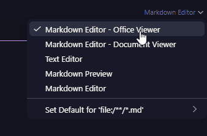

# *Curso de JavaScript*

# Referencias

* W3Schools
* mds

# Seção 1 - JavaScript - Básico

## Variáveis e Constantes

* Não podemos criar variáveis com palavras reservadas
* Variáveis precisam ter nomes significativos
* Não podemos começar o nome de uma variável com um número
* Não podem conter espaços ou traços
* Utilizamos camelCase
* Case-sensitive
* Não podemos redeclarar variáveis com let
* Não utilize var, sempre utilize let

## Tipos Primitivos

* Tipos primitivos não são passados por referência, são passados por valor. Como ocorreu com o array;
* String, number, boolean, undefined, null e symbol são tipos primitivos;

## Operadores Aritméticos

* Adição / concatenação -------> +
* Subtração ---------------------> -
* Multiplicação -----------------> *
* Divisão ------------------------> /
* Modulo - Resto da divisão ---> %
* Exponenciação ----------------> **
* incremento --------------------> ++
* decremento -------------------> --
* Operador de Atribuição ------> +=

### Precedencia

1. ( )
2. **
3. /, *, %
4. +, -

